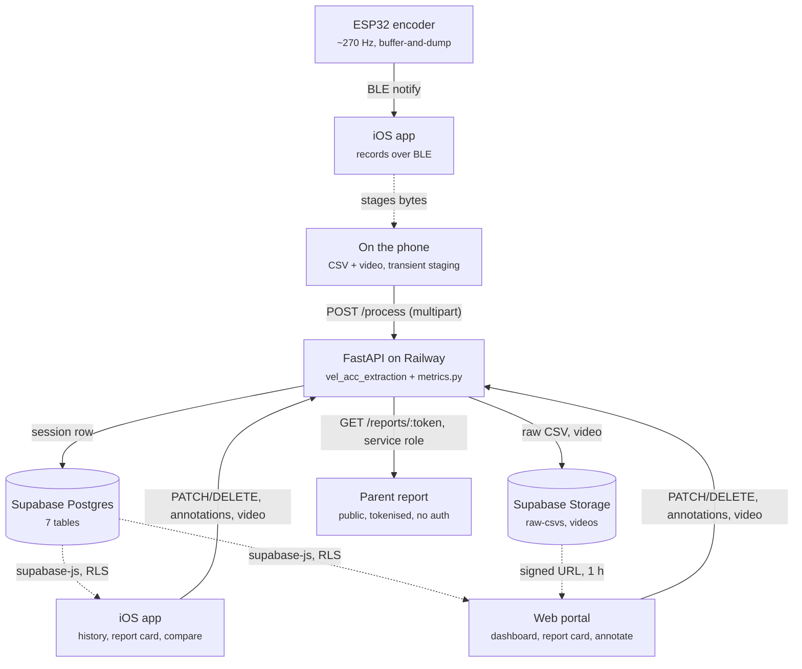
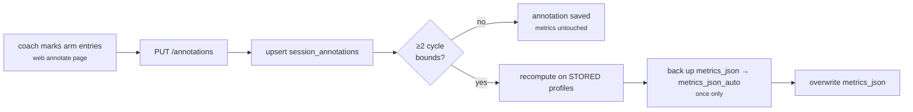
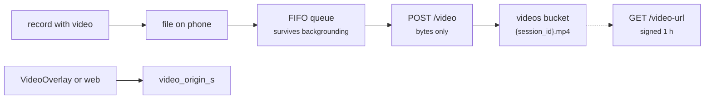

# Swimnetics Data Flow

Where every byte lives, who put it there, and who reads it back.

---

## 1. Read this first

**What this document owns:** the data topology of the whole product path — the stores, every
field in them, every API endpoint and its real callers, and the paths data takes between them.

**What it does not own:** folder maps, build state, deploy state and version-control gaps
(those stay in [CODEBASE-AUDIT.md](CODEBASE-AUDIT.md)); endpoint-by-endpoint defect findings
(those stay in [API-AUDIT.md](API-AUDIT.md)); and signal-processing behaviour (that stays in
[CLAUDE.md](CLAUDE.md)).

**It supersedes** `CODEBASE-AUDIT.md` §4 (connection matrix) and `API-AUDIT.md`'s endpoint
inventory. Both were accurate when written and both now predate Phases 57–61.

**How it goes stale.** Section 11's figures are a dated snapshot from a live database that
changes every time someone swims. Re-take them with `python tools/dataflow_probe.py`. The
structural claims — which store holds what, which endpoint has which caller — go stale when
code changes, and nothing enforces that. Treat a `file:line` citation as a starting point, not
a promise.

**Scope note.** Sections 7–9 (lifecycle walkthroughs, why-each-thing-exists, known
inconsistencies) are written by plan 63-02 and are placeholders below.

---

## 2. Master diagram

Solid edges are writes that go through the API. Dashed edges are reads that go straight to
Postgres under row-level security. That split is the single most important thing on this page,
and section 6 covers the exceptions.



Three things the diagram is deliberately saying:

- **The encoder never talks to the internet.** It talks to a phone over BLE, and the phone is
  the only thing that ever uploads. Firmware keeps recording through a BLE disconnect.
- **All signal processing happens server-side.** The phone uploads counts; it does not compute
  velocity. What it displays comes back from `/process` or out of Postgres.
- **The parent report is the odd one out** — no auth, no RLS, service-role read through the API.
  It is the only public surface that touches athlete data.

---

## 3. The four data stores

There are four, not two. Two of them are transient, and confusing a transient store for an
authoritative one is how you end up believing the app works offline.

| Store | Holds | Authoritative for | Lifetime |
|---|---|---|---|
| **Supabase Postgres** | 7 tables (§4) | everything the product reads | permanent |
| **Supabase Storage** | `raw-csvs`, `videos` — both **private** | the source bytes a session was derived from | permanent |
| **Phone-local** | the raw CSV at `FileSystem.documentDirectory` ([RecordScreen.js:228](../swimnetics-mobile/src/screens/RecordScreen.js:228)); the recorded video until the upload queue drains it ([videoUploadQueue.js:82](../swimnetics-mobile/src/lib/videoUploadQueue.js:82)) | **nothing** — staging only | until upload |
| **Laptop-local** | `raw/`, `processed/`, `output/`, `annotations_export.json` | **nothing** — dev corpus only | indefinite, untracked |

### Storage layout

| Bucket | Key format | Written by | Read by |
|---|---|---|---|
| `raw-csvs` | `{athlete_id}/{timestamp}.csv` ([api.py:287](api.py:287)) | `POST /process` | nothing in the product; deleted with the session ([api.py:739](api.py:739)) |
| `videos` | `{session_id}.mp4` ([api.py:1000](api.py:1000)) | `POST /sessions/{id}/video` | via 1-hour signed URL ([api.py:1048](api.py:1048)) — bytes never proxy through the API |

### The phone is not an offline store

`PROJECT.md` lists "Offline-safe recording: local CSV buffer, upload queues and retries" as an
unchecked Must Have, and that is accurate. **There is no AsyncStorage session cache.** Every
mobile screen queries Supabase live on focus. The CSV is written locally only so the multipart
upload has a file to point at, and the video queue is FIFO-with-retry for the video alone.

Consequence: with no network, a coach can still *record* (BLE and the firmware's buffer-and-dump
do not need the internet) but cannot process, view history, or see results.

---

## 4. Field dictionary

Column types are from `supabase/live_schema.json`, refreshed by `tools/introspect_schema.py`.
The jsonb expansions are sampled from live rows by `tools/dataflow_probe.py`.

### 4.1 `sessions` — 19 columns, the centre of the system

| Column | Type | Meaning |
|---|---|---|
| `id` | uuid | primary key |
| `athlete_id` | uuid | → `athletes.id` |
| `coach_id` | uuid | → `coaches.user_id`; the ownership column for RLS and API checks |
| `device_id` | **text** | the ESP32 chip id. Text, not uuid — patch_06, Phase 45 |
| `stroke_type` | text | `freestyle` / `backstroke` / `butterfly` / `breaststroke`. **Not patchable** — set once at `/process` |
| `recorded_at`, `created_at` | timestamptz | when swum / when the row landed |
| `name`, `notes` | text | coach-supplied; both usually NULL (§11) |
| `is_starred` | boolean | list filter |
| `upload_status` | text | `'complete'` on every row ever written (§11) |
| `raw_csv_path` | text | key into `raw-csvs` |
| `video_path` | text | key into `videos`, or NULL |
| `video_origin_s` | double | session-clock time at video t=0, end-anchored |
| `sample_rate_hz` | double | **the authoritative per-session rate.** NULL = predates Phase 52 |
| `velocity_profile` | jsonb | `[float]`, m/s, one per sample |
| `distance_profile` | jsonb | `[float]`, m, one per sample |
| `metrics_json` | jsonb | the metrics object (§4.2) |
| `metrics_json_auto` | jsonb | one-shot backup of the auto result before an annotation overwrote it |

⚠ **`velocity_profile` and `distance_profile` are index-aligned to `sample_rate_hz`, not to
100 Hz.** Time for sample `i` is `i / sample_rate_hz`. On a NULL rate, readers fall back to 100,
which reproduces exactly how those rows always behaved — that fallback is for old rows only and
must never be applied to a row that has a rate. A live row measured 2,086 samples at
**89.99 Hz** (§11).

⚠ **`metrics_json` has two writers.** `POST /process` writes it from the auto pipeline;
`PUT /sessions/{id}/annotations` **overwrites** it with metrics recomputed from human
boundaries, preserving the original in `metrics_json_auto` once and only once
([api.py:910-912](api.py:910)). `DELETE` on the annotation restores it. 24 of 62 live rows have
been through this.

### 4.2 `metrics_json` — four top-level keys

`{cycles, data_quality, initial_phase, session}`

**`.session`** — 24 keys, the per-session summary every surface reads:

```
baseline_end_s, cv_arm_peak_vel, cv_isi, fatigue_index_pct, implausible_cycle_count,
kick_metrics_reliable, lap_time_s, max_vel_ms, mean_arm_kick_delay_s, mean_arm_kick_ratio,
mean_arm_peak_vel_ms, mean_coast_fraction, mean_dps_m, mean_impulse_m, mean_isi_s,
mean_trough_vel_ms, mean_vel_ms, outlier_cycle_count, pct_cycles_with_kick,
segmentation_reliable, stroke_count, stroke_rate_spm, total_cycles_raw, total_dist_m
```

⚠ **`CLAUDE.md`'s "Session metric keys" list is incomplete** — it names 19 of these 24. The five
it omits (`implausible_cycle_count`, `kick_metrics_reliable`, `outlier_cycle_count`,
`segmentation_reliable`, `total_cycles_raw`) are all quality fields that also appear in
`.data_quality`. Recorded as a finding for 63-02.

**`.data_quality`** — `{implausible_cycle_count, magnet_dropout_pct, outlier_cycle_count,
segmentation_reliable, total_cycles_raw, warnings}`. Four of these six duplicate `.session`.

**`.initial_phase`** — `{dive_detected, dive_duration_s, initial_phase_end_idx,
pulldown_detected, pulldown_duration_s, pulldown_peak_vel_ms}`.

**`.cycles[]`** — one object per detected stroke cycle:

```
arm_kick_delay_s, arm_kick_vel_ratio, arm_peak_idx, arm_peak_vel, coast_fraction, cycle_num,
dead_spot_s, dist_m, duration_s, end_idx, impulse_m, kick_peak_idx, kick_peak_vel, mean_vel_ms,
peak_idx, phase, start_idx, trough_vel_ms
```

⚠ **`phase` is a legacy key.** Phase 61-01 removed the steady/`ramp_up` split and stopped
emitting it. Rows written before that still carry it, so a reader must not depend on the key in
either direction. `*_idx` fields index into `velocity_profile`, so they are also rate-relative.

### 4.3 `session_annotations` — human ground truth

| Column | Type | Meaning |
|---|---|---|
| `session_id` | uuid | primary key; one annotation per session |
| `phases` | jsonb | `{dive_start_s, finish_s, stroke_start_s, underwater_start_s}` — the four canonical markers, times in seconds ([annotations.py:44](annotations.py:44) `PHASE_KEYS`) |
| `stroke_marks_s` | jsonb | `[float]` — **one mark per ARM ENTRY**, not per cycle |
| `source` | text | `manual` |
| `updated_by` | uuid | the coach |
| `created_at`, `updated_at` | timestamptz | |

⚠ **Marks are not cycles.** `annotations.MARKS_PER_CYCLE` is 2 for freestyle and backstroke and
1 for butterfly and breaststroke ([annotations.py:65](annotations.py:65)) — physiology, not
configuration. `LEGACY_PHASE_KEYS` tolerates a retired `breakout_start_s` on read; api.py
rebuilds `phases` from `PHASE_KEYS`, so the key drops out on the next write.

### 4.4 `reports` — parent progress reports

| Column | Type | Meaning |
|---|---|---|
| `id`, `athlete_id`, `coach_id` | uuid | |
| `token` | text | the public URL secret. **No expiry** |
| `config_json` | jsonb | `{start, end, metrics, message}` — ISO date range, a list of metric key strings, and an optional coach note ([ReportBuilder.js:42-48](web/components/portal/ReportBuilder.js:42)) |
| `sent_at` | timestamptz | set when the coach dispatches; NULL until then |
| `created_at` | timestamptz | |

⚠ **`reports` rows are written directly by clients, not by the API** — see §6.

### 4.5 `athletes`, `coaches`, `teams`, `devices`

| Table | Columns | Notes |
|---|---|---|
| `athletes` | `id, team_id, name, dob, parent_email, parent_name, head_waist_m, stroke_type, created_at` | ⚠ **No `coach_id`** — scoping is by `team_id`. A phantom `coach_id` broke four features until Phase 51-02 |
| `coaches` | `user_id, team_id, email, role, athlete_limit, device_limit, monthly_session_limit, stripe_customer_id, subscription_status, subscription_tier, id, created_at` | `user_id` is the Supabase auth id — the join key for ownership |
| `teams` | `id, name, coach_limit, device_limit, swimmer_limit, stripe_customer_id, subscription_tier, created_at` | ⚠ Billing state is duplicated between `coaches` and `teams` |
| `devices` | `chip_id (PK), coach_id, name, firmware_version, last_seen_at, created_at` | ⚠ **Keyed on `chip_id`; there is no `id` column** |

---

## 5. API surface

24 endpoints on `api.py`, Railway at `https://swimnetics-api-production.up.railway.app`.
Auth is a Supabase Bearer JWT verified with `auth.get_user()`; writes then use the service-role
client. Callers below were re-derived from source, not copied from `API-AUDIT.md`.

| Method | Path | Auth | Callers |
|---|---|---|---|
| GET | `/health` | no | Railway health check (infrastructure, no code caller) |
| POST | `/process` | yes | mobile [RecordScreen.js:253](../swimnetics-mobile/src/screens/RecordScreen.js:253) |
| GET | `/sessions/{id}/export` | yes | **no caller** — iOS builds its CSV client-side |
| GET | `/sessions/{id}/ratings` | yes | web [PillarCards.js:120](web/components/portal/PillarCards.js:120) · mobile PillarCards.js:134, CompareScreen.js:43 |
| GET | `/team/overview` | yes | web [app/page.js:15](web/app/app/page.js:15) · mobile AthletesScreen.js:43, DashboardScreen.js:62 |
| PATCH | `/sessions/{id}` | yes | web [sessions/page.js:106](web/app/app/sessions/page.js:106), [sessions/[id]/page.js:180](web/app/app/sessions/[id]/page.js:180) · mobile ReportCardScreen.js:255+307, SessionHistoryScreen.js:54 |
| DELETE | `/sessions/{id}` | yes | web [sessions/page.js:125](web/app/app/sessions/page.js:125) · mobile ReportCardScreen.js:308 |
| GET | `/sessions/{id}/annotations` | yes | web [annotate/[id]/page.js:63](web/app/app/annotate/[id]/page.js:63) |
| PUT | `/sessions/{id}/annotations` | yes | web [annotate/[id]/page.js:322](web/app/app/annotate/[id]/page.js:322) |
| DELETE | `/sessions/{id}/annotations` | yes | web [annotate/[id]/page.js:355](web/app/app/annotate/[id]/page.js:355) |
| POST | `/sessions/{id}/video` | yes | web [VideoPane.js:145+171+190](web/components/portal/VideoPane.js:145) · mobile videoUploadQueue.js:82, VideoOverlayScreen.js:148 |
| GET | `/sessions/{id}/video-url` | yes | web [VideoPane.js:67](web/components/portal/VideoPane.js:67) · mobile ReportCardScreen.js:275 |
| GET | `/annotations/export` | yes | **no caller** — `fetch_annotations.py` reads Supabase directly instead ([fetch_annotations.py:27](fetch_annotations.py:27)) |
| GET | `/reports/{token}` | **no** | web [report/[token]/page.js:41](web/app/report/[token]/page.js:41) |
| GET | `/devices` | yes | mobile DevicesScreen.js:29 |
| PATCH | `/devices/{chip_id}` | yes | mobile DevicesScreen.js:47 |
| DELETE | `/devices/{chip_id}` | yes | mobile DevicesScreen.js:66 |
| POST | `/athletes` | yes | web [AddAthleteModal.js:17](web/components/portal/AddAthleteModal.js:17) · mobile AthletesScreen.js:66 |
| POST | `/coach/chat` | yes | web [CoachChat.js:31](web/components/portal/CoachChat.js:31) · mobile CoachChatSheet.js:26, DashboardScreen.js:91 |
| POST | `/billing/checkout-session` | yes | **no caller** |
| POST | `/billing/portal-session` | yes | **no caller** |
| GET | `/billing/complete` | **no** | Stripe redirect target, referenced by api.py itself ([api.py:1734](api.py:1734)) |
| POST | `/billing/webhook` | **no** | Stripe |
| GET | `/billing/status` | yes | **no caller** |

**Six endpoints have no product caller**: `/sessions/{id}/export`, `/annotations/export`, and
four of the five billing routes. That is 25% of the surface. It is not necessarily wrong —
billing is deliberately unexposed — but it is worth knowing before you go looking for the UI.

**No caller anywhere reaches `teams` through the API.** The table is read directly by mobile
([SettingsScreen.js:51](../swimnetics-mobile/src/screens/SettingsScreen.js:51),
DashboardScreen.js:76, AthletesScreen.js:46) and never by `api.py`.

---

## 6. The two doors

**The rule:** reads go straight to Postgres via `supabase-js` under RLS; writes go through the
API. This is why a feature can look "half implemented" — the read half exists in the client and
the write half exists on the server, and neither file mentions the other.

Direct-read sites: 21 in `web/`, 22 in the mobile `src/`.

### Why reads bypass the API

RLS enforces ownership at the database, so a direct read is not a security hole — the anon key
plus the coach's JWT only ever returns their own rows. Routing reads through the API would add
a hop and duplicate the policy in Python. Writes go through the API because they need the
service-role client, the tier checks, and — for `/process` — the signal pipeline.

### The exceptions, all of them

| Exception | Where | What it means |
|---|---|---|
| `reports` **insert** | web [ReportBuilder.js:49](web/components/portal/ReportBuilder.js:49) · mobile AthleteDetailScreen.js:50 | parent reports are created client-side; the API has no create-report endpoint |
| `reports` **update** (`sent_at`) | web [ReportSendList.js:41](web/components/portal/ReportSendList.js:41) · mobile AthleteDetailScreen.js:61 | dispatch is recorded client-side |
| `reports` **delete** | web [ReportSendList.js:66](web/components/portal/ReportSendList.js:66) | |
| `athletes` **update** | web [athletes/page.js:28](web/app/app/athletes/page.js:28) · mobile AthleteDetailScreen.js:74 | `POST /athletes` creates through the API, but edits do not |
| `athletes` **delete** | mobile [AthleteDetailScreen.js:85](../swimnetics-mobile/src/screens/AthleteDetailScreen.js:85) | delete exists on mobile only, and bypasses the API entirely |
| `teams` **update** | mobile [SettingsScreen.js:58](../swimnetics-mobile/src/screens/SettingsScreen.js:58) | team rename, client-side |

So the honest version of the rule is: **`sessions` writes go through the API; `reports`,
`athletes` edits and `teams` do not.**

### The third door: the public report

`GET /reports/{token}` takes no auth at all and reads with the service-role client, bypassing
RLS by design — a parent has no account. The token is the entire access control, and it does not
expire.

---

## 7. Lifecycle walkthroughs

### 7.1 Record → process → store → display

```mermaid
flowchart LR
  A["swim<br/><small>encoder logs to RAM</small>"] --> B["BLE dump<br/><small>after the swim</small>"]
  B --> C["CSV written<br/><small>documentDirectory</small>"]
  C --> D["POST /process"]
  D --> E["dropout counted<br/><small>from raw text</small>"]
  E --> F["run_pipeline<br/><small>counts → velocity</small>"]
  F --> G["compute_session_metrics"]
  G --> H["CSV → raw-csvs"]
  H --> I["row → sessions"]
  I --> J["JSON back to phone"]
```



1. The firmware buffers samples in RAM and dumps over BLE **after** the swim. It keeps recording
   through a disconnect, so the swim itself needs no live link.
2. The phone writes `timestamp_us,angle_counts,magnet_ok` to a local file
   ([RecordScreen.js:228](../swimnetics-mobile/src/screens/RecordScreen.js:228)) and uploads it
   as multipart with `athlete_id`, `stroke_type`, `head_waist_m`, `device_id`, `name`, `notes`.
3. **Magnet dropout is counted from the raw CSV text before any processing**
   ([api.py:150-160](api.py:150)) — it is the fraction of rows with `magnet_ok == 0`, and it is
   the only quality number that cannot be recovered later, because the pipeline drops those rows.
4. `run_pipeline(df, 100.0)` returns `t_dec, dist_dec, vel, accel, actual_fs`
   ([api.py:172](api.py:172)). **The 100.0 is a request, not a result** — decimation is by an
   integer factor, so `actual_fs` is typically ~89.5 Hz.
5. `compute_session_metrics` receives `stroke_type`, which selects the segmenter
   ([api.py:175-177](api.py:175)).
6. Four warnings are assembled ([api.py:180-197](api.py:180)). ⚠ The kick warning is appended
   **unconditionally** and the segmentation warning fires whenever `segmentation_reliable` is
   false — which is always, on the auto path. So `warnings.length > 0` carries no information.
7. Tier limits are checked only when `ENFORCE_TIER_LIMITS` is on. It defaults **off**
   ([api.py:225](api.py:225)), so no limit is enforced today.
8. The CSV goes to `raw-csvs`. **Upload failure is non-fatal** — `storage_path` is set to None
   and the session row is still written ([api.py:296](api.py:296)).
9. The device row is **upserted** on `chip_id`, so recording from a new encoder registers it
   automatically.
10. The `sessions` row is inserted with the metrics, both profiles, and `actual_fs` as
    `sample_rate_hz` ([api.py:314-319](api.py:314)).
11. The response goes back to the phone, which renders results from the response — not from the
    database — so the results screen is correct even if the insert failed.

⚠ **If `athlete_id` is absent, nothing is saved at all.** Processing runs and metrics return,
but the whole storage block is skipped ([api.py:214](api.py:214)).

### 7.2 Annotate → recompute → overwrite

This is the flow most worth understanding, because it is the only one that **rewrites data that
already existed**.



1. The coach places one mark per **arm entry** plus the four phase markers.
2. `PUT /sessions/{id}/annotations` upserts on `session_id` — one annotation per session.
3. `annotation_to_overrides` converts times to indices **at that session's own `fs`**, and pairs
   marks into cycles using `stroke_type` ([api.py:880-882](api.py:880)).
4. Recompute runs on the **stored** `velocity_profile` and `distance_profile`, not on the raw
   CSV — `t_arr = arange(size) / fs` ([api.py:890](api.py:890)). Nothing is re-downloaded.
5. `metrics_json_auto` receives the original **only if it is currently NULL**
   ([api.py:911-912](api.py:911)) — so re-annotating never destroys the true auto baseline.
6. `data_quality` is merged, not replaced: dropout and warnings carry over (they came from the
   raw CSV and cannot be recomputed), cycle counts refresh, and
   `segmentation_reliable` is set **True** with `recomputed_from_annotation: True` added.
7. **Recompute failure is non-fatal.** The annotation is kept and `recompute_error` is returned
   ([api.py:915](api.py:915)) — so a session can have human marks whose metrics never took.
8. `DELETE` on the annotation restores `metrics_json` from `metrics_json_auto`.

⚠ **`segmentation_reliable` is the only place it ever becomes True.** On every auto-processed
session it is hardcoded False.

### 7.3 Video → upload → origin → sync



1. The camera records alongside the BLE session; the file uploads in the background.
2. **The background upload sends the file only — not the origin.** `video_origin_s` is written
   separately, historically only by the phone's `VideoOverlayScreen`, and since Phase 61-03 also
   by the web, which computes an end-anchored origin when none is stored and never overwrites one.
3. Playback fetches a **1-hour signed URL**; video bytes never proxy through the API
   ([api.py:1048](api.py:1048)).

⚠ **This is why 5 live sessions have video and no origin** (§9 F-b). They were uploaded but
never opened anywhere that writes an origin. The fix was forward-looking; those rows were not
backfilled.

### 7.4 Parent report

1. A coach generates rows **client-side** into `reports` with a `crypto.randomUUID()` token
   ([ReportBuilder.js:49](web/components/portal/ReportBuilder.js:49)).
2. The parent opens `/report/{token}`, which calls `GET /reports/{token}` — **no auth**.
3. The API reads with the service-role client, because RLS would block an anonymous read
   ([api.py:1117-1130](api.py:1117)). It resolves the token → athlete → sessions in the
   configured date range, and returns only the metric keys named in `config_json.metrics`.

⚠ The token never expires and is the only credential.

### 7.5 Coach chat

1. `POST /coach/chat` anchors on a session id and loads that row's `metrics_json`
   ([api.py:1463](api.py:1463)).
2. A bounded tool-use loop lets the model request tools from `coach.py` / `roster_metrics.py` /
   `drills.py`. **The server decides whether to honour each request** — the client never supplies
   metrics.

⚠ The athlete-scoped tools are bound to the anchor session's athlete and expose no athlete
parameter, so naming a different swimmer cannot re-scope them (ROADMAP row 56).

---

## 8. Why each thing exists

Every claim below is either sourced to a phase or a file, or explicitly marked as inferred.

**Why all processing is server-side.** `PROJECT.md` requires it — "FastAPI backend: wraps
existing Python signal pipeline; all processing server-side" (Phase 4) — and the constraint
"Python backend must be preserved" says why: `vel_acc_extraction.py` and `metrics.py` are not to
be rewritten in JavaScript. The phone would also have to ship SciPy and PyWavelets.

**Why the velocity and distance profiles are stored, not recomputed.** Phase 7's goal states it:
store the full session results so the report card can render without the raw CSV. It is what
makes annotate-and-recompute possible without downloading anything (§7.2 step 4), and what let
the Phase-59 scoring harness run without touching storage.

**Why `sample_rate_hz` exists, and why NULL is not backfilled.** Phase 52. `decimate_signal`
decimates by an integer factor, so the requested 100 Hz is never achieved, and the true value was
being *discarded at write time* — six consumers then assumed 100. Rows predating the migration
are left NULL deliberately: filling them with 100 would erase the distinction between "genuinely
100" and "unknown", and 60-01 later measured that most of them are actually ~90.

**Why `metrics_json_auto` exists.** Because `PUT /annotations` overwrites `metrics_json` in
place. Without a backup, accepting a human annotation would permanently destroy the automatic
result, and the two could never be compared. Once-only (§7.2 step 5) so re-annotating cannot
overwrite the true baseline with an already-human-derived one.

**Why reads bypass the API.** RLS enforces ownership in the database, so a direct read returns
only the coach's rows; routing reads through the API would add a hop and duplicate the policy in
Python. *Inferred — the repo records no decision for this, and it is at least partly historical:
the web portal (Phase 23) was built directly on supabase-js and the API was added around it.*

**Why the parent report has no auth.** Parents have no accounts. `api.py:1117` says so in the
docstring: the token is the only credential and RLS blocks anonymous reads, which is why this one
endpoint uses the service-role client.

**Why `stroke_type` is not patchable.** *Inferred — no decision is recorded.* What IS recorded is
the consequence: a wrong value halves or doubles the derived stroke rate and cannot be corrected
through the API, which is why `PUT /annotations` returns `cycles_derived` and `marks_per_cycle`
so a wrong value is visible immediately ([api.py:928-931](api.py:928)).

**Why marks are per arm entry, not per cycle.** Phase 57 D3. One mark per arm entry is unambiguous
to place; "one per cycle" requires the labeller to decide where a cycle starts. Pairing is then
derived from `stroke_type` — 2 for freestyle and backstroke, 1 for butterfly and breaststroke —
which is physiology, not a setting.

**Why the segmenter registry lives in `metrics.py` and not in `annotations.py`.** Phase 59.
`MARKS_PER_CYCLE` describes the *labelling convention* and is exact; boundaries-per-cycle
describes what a *detector* emits and is neither exact nor constant. Importing one into the other
would conflate them.

**Why `upload_status` exists.** *Inferred — not recorded.* It has only ever held `'complete'`
(§9 F-c). The name suggests a planned queued/failed/retrying lifecycle for the offline-safe
recording that `PROJECT.md` still lists as unbuilt.

**Why the raw CSV is kept after processing.** *Inferred.* Nothing in the product reads it — but
it is the only artefact from which a session can be reprocessed if the pipeline changes, and the
pipeline has changed four times in ways that moved stored metrics.

**Why the device row is upserted rather than required.** Phase 14 deferred QR device
registration; upserting on `chip_id` at `/process` means an unregistered encoder self-registers
on first use rather than blocking a recording.

---

## 9. Known inconsistencies

Recorded, not fixed. Each is a candidate for real work, not a defect being hidden.

| # | Where | What is wrong | Proposed fix |
|---|---|---|---|
| **F-a** | [fetch_sessions.py:30](fetch_sessions.py:30) | `FS = 100.0 # profiles stored at 100 Hz`. False since Phase 52; the rate is per-session | Read `sample_rate_hz` from the row, fall back to 100 only when NULL |
| **F-b** | live data | **5 of 62 sessions have `video_path` and NULL `video_origin_s`** — video exists, sync origin does not. 61-03 fixed the path forward and did not backfill | One-off backfill computing the end-anchored origin, or accept and let the web compute on open |
| **F-c** | `sessions.upload_status` | `'complete'` on 62/62 rows; has never discriminated anything | Either implement the queued/failed lifecycle it implies, or drop the column |
| **F-d** | §6 | `reports` insert/update/delete, `athletes` edits and `teams` update bypass the API; athlete **delete** exists on mobile only | Decide deliberately: either add endpoints, or document the client-write path as intended |
| **F-e** | [CODEBASE-AUDIT.md](CODEBASE-AUDIT.md) §4 | Predates Phases 47, 51, 52, 57–61 | Stamped by 63-02 to point here |
| **F-f** | live data | ⭐ **The newest stored session still carries `cycles[].phase`**, which 61-01 stopped emitting. **This may not be a defect** — it means no session has been processed by post-61-01 code, so either nothing has been recorded since, or Railway has not taken the deploy | Check the Railway deploy before trusting any new-vintage metric. Confirm by recording one session and re-running the probe |
| **F-g** | [CLAUDE.md](CLAUDE.md) | "Session metric keys" names **19**; live rows carry **24**. Missing: `implausible_cycle_count`, `kick_metrics_reliable`, `outlier_cycle_count`, `segmentation_reliable`, `total_cycles_raw` — all of which also duplicate into `.data_quality` | Add the five, and note the duplication |
| **F-h** | [api.py](api.py) | **6 of 24 endpoints have no product caller**: `/sessions/{id}/export`, `/annotations/export`, and 4 of 5 billing routes. `fetch_annotations.py` reads Supabase directly rather than calling the endpoint named after it | Leave billing (deliberately unexposed); decide whether the two export endpoints should be wired or deleted |
| **F-i** | schema | `devices` is keyed on `chip_id` and has **no `id` column** — any code assuming a uniform `id` primary key breaks on it | None needed; documented so the next tool does not repeat it |
| **F-j** | [.gitignore:16](.gitignore) | `GLOSSARY.md` and `STRATEGY.md` are **gitignored** — production documentation existing on one laptop only. `API-AUDIT.md` had the same problem until 63-02 | Un-ignore both, as `CODEBASE-AUDIT.md` and `DATA-FLOW.md` already are |
| **F-k** | [api.py:180-197](api.py:180) | The kick warning is appended **unconditionally** and the segmentation warning fires on every auto session, so `warnings.length > 0` is true for essentially every session and carries no signal | Make both conditional, or have clients filter — mobile's `dropoutWarning.js` already does |

---

## 10. Not in the product path

These exist in the repo and are not part of how a coach's data flows. Each is one line on
purpose — mapping them in detail dates fast.

| Path | What it is |
|---|---|
| `app.py` | Streamlit desktop analysis tool. Predates the phone; the web portal now covers its features |
| `tools/*.py` | Offline analysis and audit CLIs (`score_segmenter`, `backfill_preview`, `rampup_impact`, `introspect_schema`, `schema_contract`, `dataflow_probe`, `segmenter_candidates`, `window_candidates`) |
| `fetch_sessions.py`, `fetch_annotations.py`, `inspect_cycles.py`, `pipeline_view.py` | Dev fetch-and-inspect scripts. Read Supabase directly with the service key. Need `python-dotenv`, which is not in `requirements.txt` |
| `seed_demo_team.py` | Synthetic demo-team seeder. Phase 50, **paused**; still untracked |
| `segmenter_eval.py` | The Phase-59 scoring harness (pure module; the CLI is `tools/score_segmenter.py`) |
| `vel_acc_extraction_test*.py`, `wavelet_spike.py`, `segment_motif_spike.py` | Signal-processing experiments. `vel_acc_extraction.py` is the production file |
| `pose/`, `pose_extraction.py`, `merge_streams.py`, `video_sync.py` | Vision pipeline exploration. Not wired to anything |
| `raw/`, `processed/`, `output/` | Local dev corpus. `raw/` predates both encoder-integrity fixes of 2026-06-22 |
| `ESP_32_V5/` | Current firmware 1.1.0. Older sketch directories are legacy |
| `logger.py`, `logger_ble.py`, `as5600_diagnostic/` | Bench logging and encoder diagnostics |
| `web/app/(marketing)`, `web/lib/blog.js` | Marketing site and build-log blog. No athlete data |

---

## 11. Snapshot

**Taken 2026-08-13.** These figures describe a live database that changes whenever someone
swims. They will go stale. Re-take them:

```bash
python tools/dataflow_probe.py
```

| Table | Rows |
|---|---|
| `sessions` | 62 |
| `session_annotations` | 24 |
| `reports` | 5 |
| `athletes` | 3 |
| `devices` | 2 |
| `coaches` | 1 |
| `teams` | 1 |

Buckets: `raw-csvs` (private), `videos` (private).

**`sessions` column population, all 62 rows:**

| Column | Non-null | Reads as |
|---|---|---|
| `athlete_id`, `coach_id`, `stroke_type`, `raw_csv_path`, `metrics_json`, `velocity_profile`, `distance_profile`, `upload_status`, `is_starred`, `recorded_at`, `created_at` | 62/62 | always set |
| `device_id` | 57/62 | 5 sessions with no device attributed |
| `sample_rate_hz` | 56/62 | **6 predate Phase 52** and fall back to 100 |
| `video_path` | 29/62 | |
| `metrics_json_auto` | 24/62 | exactly the annotation count — every annotated session had its metrics overwritten |
| `video_origin_s` | 24/62 | |
| `name` | 10/62 | why the portal generates mnemonics |
| `notes` | 2/62 | |

**Cross-column gaps:**

- **5 of 62 sessions have `video_path` set and `video_origin_s` NULL.** Video exists, sync
  origin does not. Phase 61-03 fixed the code path going forward and did not backfill.
- 6 of 62 have no recorded sample rate.
- 24 of 62 have metrics recomputed from a human annotation.

**Distributions:** stroke — freestyle 31, breaststroke 15, butterfly 15, **backstroke 1**.
`upload_status` — `complete` 62, and no other value has ever been written.

**Sampled row shapes:** `velocity_profile` and `distance_profile` were both 2,086 floats on the
newest session, whose `sample_rate_hz` is **89.99**. `stroke_marks_s` was 11 floats.
`config_json.metrics` was 6 strings.

⚠ The newest session's `cycles[0]` still carries the `phase` key, which Phase 61-01 stopped
emitting — so no session has been processed by post-61-01 code. Recorded as a finding for 63-02.
